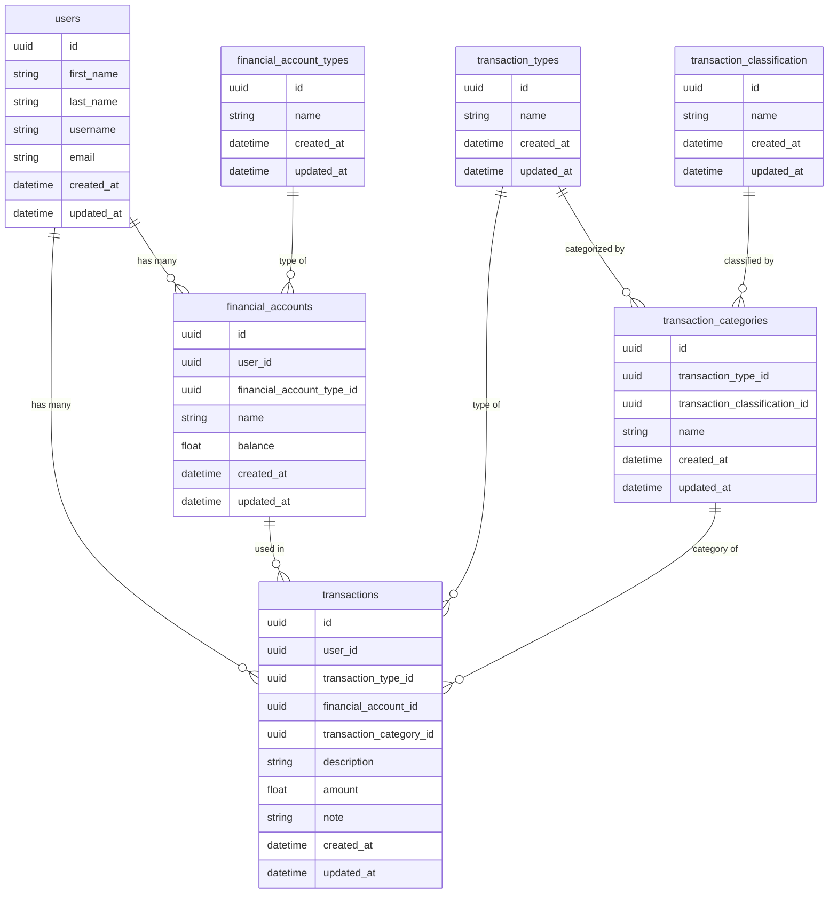

# Core Application Schema

This document defines the relational structure of the financial tracking application, including all tables, primary keys (PK), foreign keys (FK), and data types.

## I. User & Account Management

| Table Name | Description | Key Columns |
| :--- | :--- | :--- |
| **[users]** | Stores user authentication and profile data. | id (PK) |
| **[financial_account_types]** | Defines static types of accounts (e.g., Wallet, E-Wallet, Savings). | id (PK) |
| **[financial_accounts]** | Stores user-specific accounts. | id (PK), financial_account_type_id (FK), user_id (FK) |

## II. Transaction Categorization Hierarchy

This structure is normalized to allow for flexible classification of expenses, while keeping classification optional (nullable) for income.

| Table Name | Description | Key Columns |
| :--- | :--- | :--- |
| **[transaction_types]** | Top-level financial grouping (Income, Expense). | id (PK) |
| **[transaction_classification]** | Defines optional grouping (Essential, Lifestyle, Transfer).id (PK) |
| **[transaction_categories]** | Stores the specific category names (e.g., Rent, Salary, Shopping). The central source for transactions. | id (PK), transaction_type_id (FK), transaction_classification_id (FK, NULLABLE) |

## III. Transaction Logging

| Table Name | Description | Key Columns |
| :--- | :--- | :--- |
| **[transactions]** | The ledger storing all financial events. | id (PK), user_id (FK), transaction_type_id (FK), financial_account_id (FK), transaction_category_id (FK) |

---

## Detailed Schema Definition

